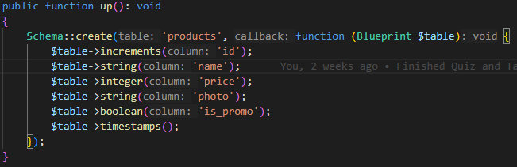
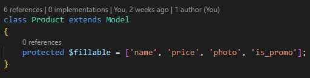
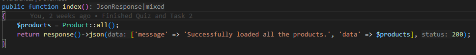
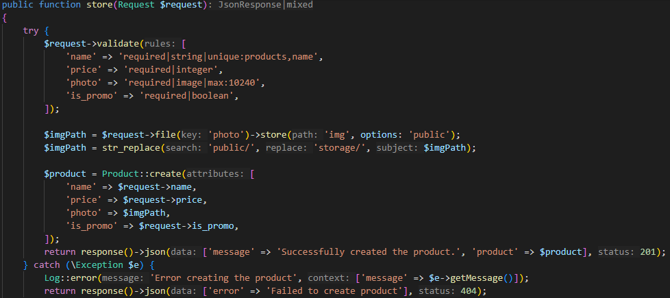
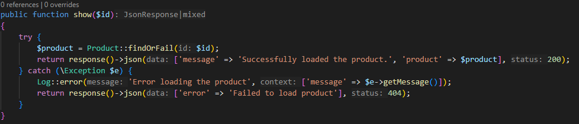
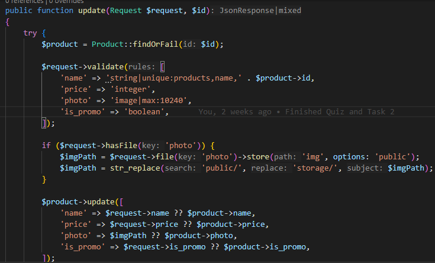
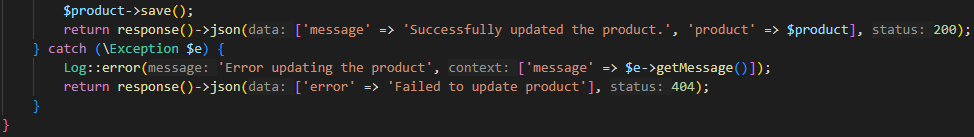
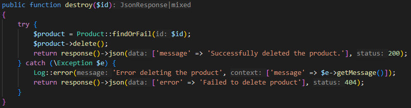

 

# Penjelasan Tugas 2

---

Sebelum menghubungkan API dari Laravel ke Flutter, kita perlu mengatur agar API dari Laravel dapat bekerja terlebih dahulu. Setelah membuat proyek Laravel baru, jalankan `php artisan install:api` untuk menambahkan API ke proyek Laravel tersebut. Instalasi akan menambahkan *file* seperti **api.php** yang berada di folder *routes*. Jalankan pula `php artisan storage:link` untuk melakukan _link_ pada _storage_ agar dapat mengakses tipe data _file_ dengan mudah.  

Di *Terminal*, ketik **`php artisan make:model Products -a --api`**. Perintah ini akan secara otomatis menambahkan _migration_, _seeder_, _factory_, dan _resource controller_ yang berada di **api.php** untuk model _Products_. 

Pertama-tama, lengkapi kode di _migration_ yang telah dibuat agar sesuai dengan yang berada pada PPT. Kolom pertama adalah kolom _id_ dengan metode `increments` agar kolom tersebut memiliki atribut _Primary Key_, _Unsigned Integer_, dan _Auto Increment_ secara langsung. Selanjutnya adalah kolom _name_ dengan tipe data _string_, kolom _price_ dengan tipe data _integer_, kolom _photo_ dengan tipe data _string_ guna menyimpan _path_ atau lokasi penyimpanan foto, serta kolom *is_promo* dengan tipe data _boolean_ untuk mengecek apakah produk sedang promo atau tidak. 
_File Migration Product_ 

Kemudian, di model _Product_, pastikan seluruh kolom dalam variabel _fillable_ agar dapat ditambah data menggunakan Postman API nantinya. 

_File Model Product_ 

Setelah itu, lengkapi seluruh metode RESTful API yang berada di _ProductController_. Pertama, pada metode `index`, kita ambil semua kolom yang berada pada model _Product_. Pakai metode _GET_ untuk mengambil data dan berikan status `200` yang berarti data berhasil di-_load_. 
_File Controller Product pada Function `index`_

_Percobaan API menggunakan Postman pada Function `index`_ 

Pada metode `store`, kita memvalidasi seluruh kolom yang dapat ditambahkan terlebih dahulu. Kolom _name_ perlu validasi bahwa tipe data yang dimasukkan adalah tipe data _string_ dan namanya unik dari nama produk lainnya. Kolom _price_ perlu validasi bahwa tipe data yang dimasukkan adalah tipe data _integer_. Kolom _photo_ perlu validasi bahwa tipe data yang dimasukkan adalah tipe data _image_, yaitu file dengan ekstensi _png, jpg,_ dan _jpeg_, dengan maksimal ukuran 10.240 _bytes_ atau 10.24 Mb. Kolom *is_promo* perlu validasi bahwa tipe data yang dimasukkan adalah tipe data _boolean_, yaitu angka 0 yang menyatakan _false_ atau angka 1 yang menyatakan _true_. Setelah validasi berhasil, maka simpan _file_ pada kolom _photo_ ke _public storage_ dengan path _img_, masukkan _path_ tersebut ke variabel **imgPath**. Setelah disimpan, tambahkan _storage/_ pada variabel tersebut dengan menggunakan metode *str_replace* yang mengubah tulisan _public/_ menjadi _storage/_ diikuti oleh nilai variabel yang sudah ada. Maka, apabila variabel tersebut memiliki nilai *public/img/123.png*, nilai tersebut akan berubah menjadi _storage/public/img/123.png_ sehingga bisa diakses oleh _storage link_ yang berada di awal. Setelah semuanya, maka buatlah model _Product_ baru dengan seluruh kolom yang sudah divalidasi dengan pengecualian kolom _photo_ yang diisi oleh variabel **imgPath**. Pastikan metode Postman adalah metode _POST_ untuk menambah data serta status respons adalah `201`, yaitu metode HTTP yang digunakan untuk data yang ditambah.

_File Controller Product pada Function `store`_

_Percobaan API menggunakan Postman pada Function `store`_ 

Pada metode `show`, kita tinggal mengambil data dengan variabel `id` yang berada di _url_ sesuai dengan _id_ dari produk. Contohnya, apabila terdapat produk dengan _id_ 2, maka masukkan angka 2 pada parameter dengan metode _GET_ untuk mengambil produk.

_File Controller Product pada Function `show`_

_Percobaan API menggunakan Postman pada Function `show`_ 

Pada metode `update`, ambil produk berdasarkan parameter `id` yang berada di _url_. Kita memvalidasi seluruh kolom produk yang akan diedit tanpa memakai parameter _required_ karena tidak semua kolom harus ada agar produk dapat diedit, serta memasukkan _exclusion_ di kolom _name_ sehingga produk tersebut tidak mengecek kolom _name_ pada produk itu sendiri sehingga kolom lain dapat diedit tanpa mengedit kolom _name_. Cek apakah data yang dimasukkan memiliki foto, baru melakukan proses penyimpanan _file_ yang sama dengan metode `store`. Setelah itu, baru edit seluruh kolom yang memiliki data baru, dan apabila tidak ada data baru maka datanya sama dengan data yang sebelumnya. Simpan perubahan tersebut menggunakan metode `save()`, panggil menggunakan metode _PUT_ (Pada Postman, dengan tipe data _form-data_ maka metode _PUT_ tidak dapat digunakan. Di gambar, dipakai metode _POST_ dengan menambahkan kolom `_method` = _PUT_ untuk mengubah metode HTTP secara manual), dan berikan status HTTP 200 untuk menandakan sukses.

_File Controller Product pada Function `update` Part 1_

_File Controller Product pada Function `update` Part 2_

_Percobaan API menggunakan Postman pada Function `update`_ 

Terakhir, pada metode `delete`, kita tinggal mencari produk dengan variabel `id` yang berada di _url_ sesuai dengan _id_ dari produk. Metode _DELETE_ digunakan untuk menghapus produk dengan _id_ tersebut.

_File Controller Product pada Function `delete`_

_Percobaan API menggunakan Postman pada Function `delete`_